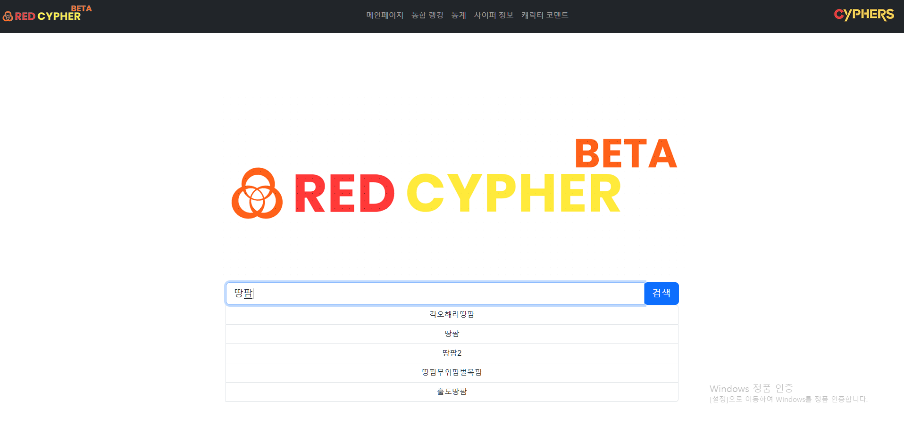
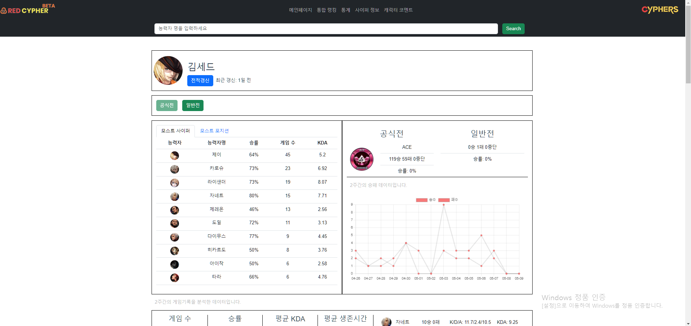
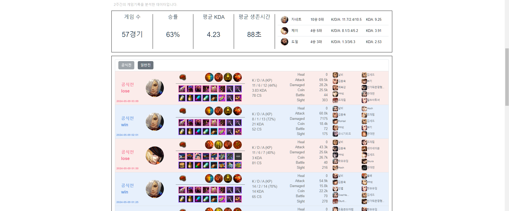
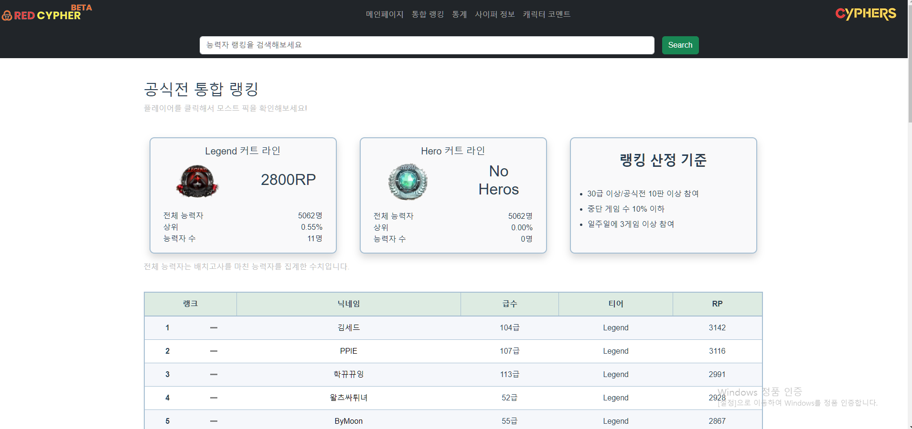
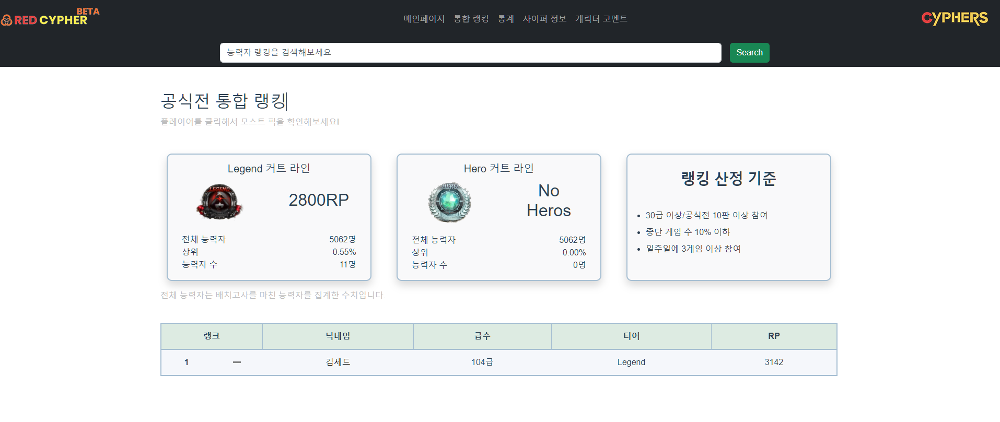

# RED CYPHER 페이지 소개
> 페이지 별 기능에 대한 이해를 돕기 위해 스크린샷과 함께 설명을 추가했습니다.

    

## 메인페이지

- 중앙의 검색 바에서 플레이어를 검색하여 해당 플레이어의 전적으로 이동합니다.
- 검색창에 텍스트 입력 시 자동완성 기능을 제공하며, 해당 닉네임의 플레이어가 존재하지 않는다면 자동완성 기능은 동작하지 않습니다.
- 존재하지 않는 플레이어를 입력 시 알람이 호출되며 메인페이지로 이동합니다.
    

## 전적페이지

- 메인페이지에서 검색 시 이동하는 페이지입니다.
- 상단에는 유저의 공식전, 일반전 승패와 티어, 모스트 픽 등 다양한 정보를 제공합니다.
- 하단에는 유저의 공성전의 전적을 자세히 표시합니다.
- 전적의 오른쪽 부분에는 같이 플레이한 유저들을 표기했으며, 해당 유저의 이미지 또는 닉네임을 클릭하면 그 유저의 전적페이지로 이동합니다.
- 상단과 하단에는 공식전, 일반전 버튼이 있으며, 버튼을 클릭하면 해당 게임에 대한 정보가 표시됩니다(페이지 좌상단의 티어 및 공성전 승패 제외).
- 공성전의 전적은 최초 20개를 호출하며 전적이 20개 이상일 경우 전적 더보기 버튼이 제공됩니다(클릭 시 20개씩 추가로 호출).
- 페이지 상단 메뉴바 아래에 검색바를 통해 메인페이지와 동일하게 플레이어 전적검색을 할 수 있습니다.
    

## 랭킹페이지

- 랭킹페이지는 상단의 메뉴바에서 통합 랭킹을 클릭하면 이동할 수 있습니다.
- 상단에는 레전드티어, 히어로티어를 진입하기 위한 티어 커트라인 RP를 표시하고, 현재 해당 티어에 속한 플레이어가 몇명이고, 상위 몇퍼센트인지 표기합니다.
- 하단에는 랭크 표가 제공됩니다. 플레이어의 기본정보와 함께 순위 등락을 표시합니다.
- 상단의 검색바를 이용해서 플레이어 랭킹을 검색할 수 있습니다. 검색 시 아래 사진과 같이 해당 플레이어의 랭킹정보가 한줄로 표시됩니다.